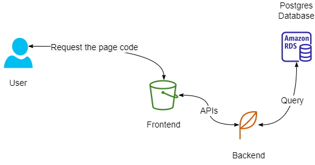

## Infrastructure
---


### Content:
1. [AWS Cloud Setup](#aws-cloud-setup)
    1. [S3 Bucket](#s3-bucket)
    2. [Elastic Beanstalk](#elastic-beanstalk)
    2. [RDS Postgres](#rds-postgres)
2. [Environment Variables](#environment-variables)

## AWS Cloud Setup
---
### S3 Bucket

> Utilizing an AWS S3 Bucket, the frontend application is deployed. The combined assets are placed in an S3 bucket, which is then made publicly accessible.

- S3 Endpoint - Frontend: `<link>`

*The application is accessible to end users via the Bucket URL.*

### Elastic Beanstalk

> The AWS Elastic Beanstalk service is used to install the application server. Elastic Beanstalk extracts the application and executes it on an endpoint once it is created, archived, and uploaded to an S3 bucket.

- Elastic Beanstalk URL - Backend: `<link>`

### RDS Postgres

> AWS RDS Postgres is the database that the application server utilizes to store and retrieve data.

- RDS - Database Host: `<link>`
- RDS - Database Port: 5432
- RDS - Database Name: postgres

# Environment Variables

Set up the following variables in the cloud environments or in the `.env` file:

```
PORT=8080
POSTGRES_USERNAME=<Database_Username>
POSTGRES_PASSWORD=<Database_Password>
POSTGRES_HOST=<Database_IP_Address>
POSTGRES_DB=<Database_Name>
URL=<Url>
JWT_SECRET=<Any_PassPhrase>
AWS_REGION=<us-east-1>
AWS_PROFILE=<Profile>
AWS_BUCKET=<Bucket_Name>
```