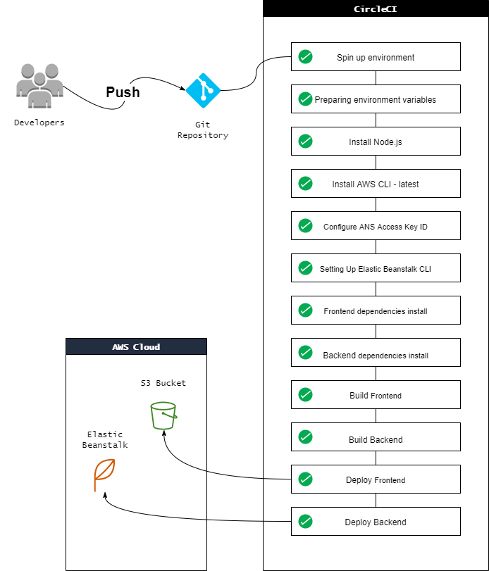

## Pipeline process
---

### Order of commands

1. The Pipeline uses Orbs to Install `Node`, `AWS CLI`, `EB CLI`.
2. It checks out the code from *the Github Repository*.
3. Install **FrontEnd & BackEnd** dependancies.
4. Build **FrontEnd & BackEnd**.
5. Deploy **FrontEnd** into `s3 bucket`.
6. Deploy **BackEnd** into `Elastic Beanstalk service`.